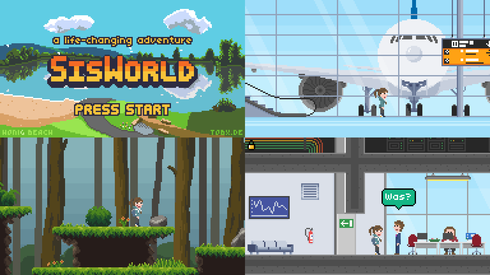

#  Sis World

This is the project page of *Sis World*, a video game that I created back in 2023 to propose to my girlfriend. She said yes! ❤️

It is free to play for everyone at: \
[https://sis-world.tobx.de](https://sis-world.tobx.de)

Currently the game is only available in German, but I am working on an English translation.

As a computer scientist I always wanted to program a computer game, so I decided to program one for my girlfriend. Half a year, many tutorials, documentations and sleepless nights later, Sis World was ready for action.

## Screenshots

## Gameplay

*Sis World* is a 2D [pixel art](https://en.wikipedia.org/wiki/Pixel_art), [side-scrolling](https://en.wikipedia.org/wiki/Side-scrolling_video_game) video game. The kind of game I loved to play as a kid in the 80s and early 90s and that I still love (check out [Huntdown](https://huntdown.com/), one of the best of its kind).

## Plot

Basicly you play as my girlfriend through episodes of our life, but I added a lot of fictional elements. The game also includes many inside jokes and situations that only we can understand. The end of the game is me proposing to her, but losing the ring while doing so.

At the premiere my girlfriend played the game with a Gamepad on the TV. I installed a [Raspberry Pi](https://en.wikipedia.org/wiki/Raspberry_Pi) computer and a [servo motor](https://en.wikipedia.org/wiki/Servomotor) behind the TV and hung the engagement ring on the servo. At the moment when I lose the ring in the game, the ring flies off the screen and the game sends a move signal to the servo and the real ring falls down behind the TV in a box. I then picked up the ring in real life and proposed to her.

The servo controller code is also included if you are interested in how it's done.

## Controls

The game can be played with a keyboard, a pointer (mouse or touch) or with a gamepad.

### Keyboard

|Action|Key|
|---|---|
|Start|<kbd>Enter</kbd>|
|Move left|<kbd>←</kbd>|
|Move right|<kbd>→</kbd>|
|Jump|<kbd>Space</kbd>|
|Action|<kbd>A</kbd>|

### Gamepad

|Action|Button|
|---|---|
|Start|<kbd>Start</kbd>|
|Move left|<kbd>←</kbd> (D-pad)|
|Move right|<kbd>→</kbd> (D-pad)|
|Jump|<kbd>B</kbd>|
|Action|<kbd>A</kbd>|

**Note:** The game uses the [Gampad API](https://developer.mozilla.org/en-US/docs/Web/API/Gamepad_API) with the [`standard`](https://w3c.github.io/gamepad/#remapping) button mapping.

### Pointer

|Action|Click \| Touch|
|---|---|
|Start|the start element|
|Move left|bottom-left quarter of screen|
|Move right|bottom-right quarter of screen|
|Jump|top half of screen|
|Action|the action hint|
